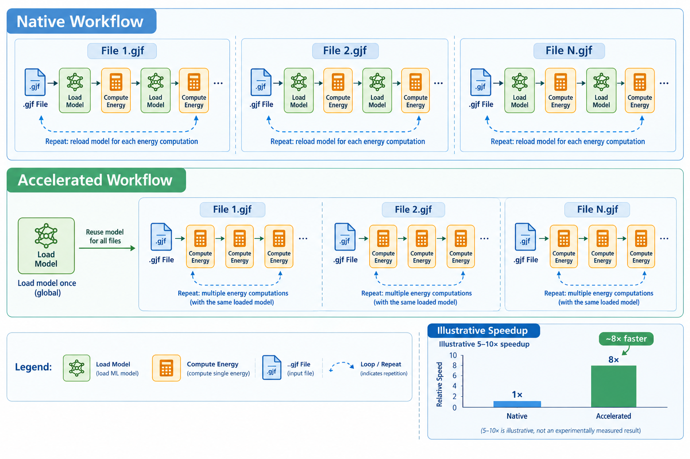

# MLIP_Gau_servers

Run machine-learned interatomic potentials (MLIPs) from Gaussian 16 through the
Gaussian External interface. One persistent server loads the model a single time
and every Gaussian step talks to it, so the model is never reloaded per step —
which is what makes geometry optimizations and other step-heavy jobs practical.

Supported models: MACE (OFF23 / OFF24 / OMol / Polar), DPA2-drug / DPA3 / DPA4,
AIMNet2, ANI-1x / 1ccx / 2x, OrbMol / OrbMolv2, GFN2-xTB / gxTB, AIQM3,
ANI-2x-D4, and any models you like.



## Quick start

```bash
git clone <your-repo-url> MLIP_Gau_APIs 
cd MLIP_Gau_APIs

# 1. Configuration: the weight paths you use, and the g16 environment if needed
cp config.example.env config.env     # fill in the absolute weight paths
cp g16-env.example.sh g16-env.sh     # only when g16 is not already on PATH

# 2. Edit your .gjf: point the route section at the forwarding script, and size the
#    Gaussian resources for whatever it computes itself: %mem=4GB and
#    %nprocshared=4 are enough, because the energy and gradients come from the MLIP
#    server.
#    external="/abs/path/MLIP_Gau_APIs/gau_scripts/Gau_generic.py"
#    test/example.gjf is a minimal job to copy and edit.

# 3. Run (starts the server, runs g16, stops the server)
./RunMLIPgjf.sh -m <method> job.gjf
./RunMLIPgjf.sh -m <method> /path/to/jobs/   # every .gjf in a directory, one server
```

## How it works

1. `RunMLIPgjf.sh` starts `mlip_server.py` for the requested model (`-m`, or
   `METHOD` from `config.env`), which loads it once and listens on TCP.
2. Every Gaussian step calls a `gau_scripts/Gau_*.py` script through
   `external=`; the script forwards the request and waits for the result.
3. When the jobs are done, the script shuts the server down.

Things worth knowing:

- **The server must be running.** A `Gau_*.py` script fails instead of loading a
  model itself.
- `Gau_generic.py` uses whatever model the server has; `Gau_<model>.py` also
  checks that the name matches.
- **Model hosting** is decided by the `calculators` package. Declarative ASE
  calculators (`ASE_MODEL_SPECS`) are built once at startup and reused. Models
  written as functions and registered with `@register_method` /
  `@register_gradient` (`mace_polar`, `orbmol`, ANI, AIMNet2, ...) are called per
  request, so a custom implementation joins the server without touching the
  library — cache the model inside the function with `get_cached_model` to load
  it once. CLI models (`aiqm3`, `d4ani`, `gxtb`) run an external program each step.

### RunMLIPgjf.sh options
 
```text
./RunMLIPgjf.sh [options] <job.gjf | directory>

  -m, --method NAME   model; overrides METHOD from config.env (default mace_off24)
  -p, --port PORT     server port (default 15556)
  -l, --log-dir DIR   write all logs here instead of next to the .gjf
  --python CMD        Python for the server (default $MLIP_PYTHON, then python3)
  --no-server         use an already running server; only run g16
  --no-warmup         skip the warm-up calculation described below
  --no-kill           leave a process that holds the port alone
```

After the server is ready, the runner sends one throwaway calculation (a water molecule).  Without the warm-up the first step of your job carries it; 
`--no-warmup` skips it.

The server needs the Python environment that has your model packages, either
directly (`MLIP_PYTHON=/path/to/conda/envs/mace/bin/python`) or through an
activation snippet (`MLIP_CONDA_SETUP="source .../conda.sh && conda activate mace"`).
`g16-env.sh` is sourced just before g16 runs (a `module load`, PATH or site script
goes there) and never affects the server.

## Requirements

Python 3.10+, numpy, ASE and Gaussian 16. Weights and external programs are
configured in `config.env`; the repository ships no machine-specific paths.

| Models | Packages | Paths | Notes |
| --- | --- | --- | --- |
| mace_omol / mace_off23 / mace_off24 / mace_polar | `mace-torch` | `MLIP_MODEL_MACE_*` | omol is conditioned on charge and spin; polar is evaluated at the center of mass, which the code handles |
| dpa2_drug / dpa3 / dpa4 | `deepmd-kit` | `MLIP_MODEL_DPA*` | dpa3 passes charge/spin as `fparam`, dpa4 as `charge_spin` |
| aimnet2 | `aimnet2calc` | — | built-in model |
| ani_1x / ani_1ccx / ani_2x | `torchani` | — | |
| orbmol / orbmol_v2 | `orb_models` (recent release), `torch` ≥ 2.4 | `MLIP_MODEL_ORBMOL*` (optional local weights) | charge and spin are model inputs; weights download automatically when the path is not set |
| xtb / gxtb | `xtb` package or executable | `MLIP_XTB_BIN` | gxtb runs the executable |
| aiqm3 | `aitomic` | `MLIP_AITOMIC_BIN` | |
| d4ani | `mlatom` | `MLIP_MLATOM_BIN` | |

## Configuration

`config.env` is read from the repository root; an environment variable of the same
name wins. Each `MLIP_MODEL_*` value must be a full path including the file name —
the directory is never searched, and a blank value fails with an error naming the
variable. `MLIP_SERVER_DEVICE` selects the device for every model the server runs
(`cuda` when a GPU is available, otherwise `cpu`).

## Logging

Logs go next to the job (server log `mlip_server_<pid>.log`, one `<JobName>.log`
per job) unless `--log-dir` collects them elsewhere. g16 runs inside the job
directory, so its own files (`%chk`, ...) stay there. The server prints one line
per request:

```text
Warm-up natoms=3  E=-2078.62909311 eV  grad=1  time=0.123s  load=3.15s
Step    natoms=3  E=-2078.63155491 eV  grad=1  time=0.123s
```

`time` is the computation only: TCP, Gaussian's own overhead and — for a lazily
loaded model — the model load are excluded, and the load appears as `load=` on the
line where it happened. The warm-up request is labelled `Warm-up`, so the first
`Step` line is the first real step of your job.

## Repository layout

```text
MLIP_Gau_APIs/
├── RunMLIPgjf.sh, RunMLIPgjf.lib.sh   Entry point and its functions
├── gau_scripts/        Forwarders called by Gaussian: Gau_generic.py,
│                       Gau_<model>.py, Gau_debug.py, _relay.py
├── mlip_server.py      Persistent MLIP server
├── mlip_relay.py       TCP client and model probe
├── calculators/        Energy and gradient calculators per model family
├── constants.py        Units, element table, device and path lookup
├── gaussian_external.py, log_utils.py
├── config.example.env, g16-env.example.sh
├── scripts/            custom_models.example.py, gen_gau_scripts.py
├── test/               example.gjf, plugin under test, pytest cases
└── docs/ADD_NEW_MODEL.md, LICENSE (MIT)
```

## Adding a model

Copy `scripts/custom_models.example.py` to `custom_models.py` and register the
model there: one dictionary entry for a standard ASE calculator, or a function
with `@register_method` / `@register_gradient`. Nothing in the library changes.

```python
# custom_models.py
ASE_CALCULATORS_EXTRA = {
    'mymodel': dict(module='mypackage', factory='MyCalculator',
                    model='mymodel', device=True),
}
```

```bash
MLIP_MODEL_MYMODEL=/abs/path/to/weights.file   # in config.env
./RunMLIPgjf.sh -m mymodel job.gjf
```

Full guide: [docs/ADD_NEW_MODEL.md](docs/ADD_NEW_MODEL.md); runnable example:
[test/](test/).

## Testing

```bash
pip install pytest && pytest test/ -v
```

The suite registers a model, starts the server and compares energy and gradients
against a direct ASE calculation, so it needs no weights; DPA4 cases skip unless
`deepmd-kit` and `MLIP_MODEL_DPA4` are available.

## Debugging

Put the debug script in the method line and run the job as usual: it writes the
geometry Gaussian hands to the interface — coordinates, charge, spin and point
charges — into an `.xyz`, returns zero energy and gradients, and exits, so the job
finishes at once. No MLIP server is involved.

```text
#p external="/abs/path/MLIP_Gau_APIs/gau_scripts/Gau_debug.py"
```

```bash
source g16-env.sh        # whatever loads g16 for you
g16 < job.gjf
```

The `.xyz` lands in the job directory, named after the file Gaussian hands to the
interface (`Gau-<pid>_test.xyz`); the charge, spin, atom count and point-charge sum
go into the job log. `./RunMLIPgjf.sh -m <method> job.gjf` works as well, but it
starts a server this job never uses.

## Contact

If you have any questions, please contact us at codeq6398@gmail.com.

## License

[MIT](LICENSE)
